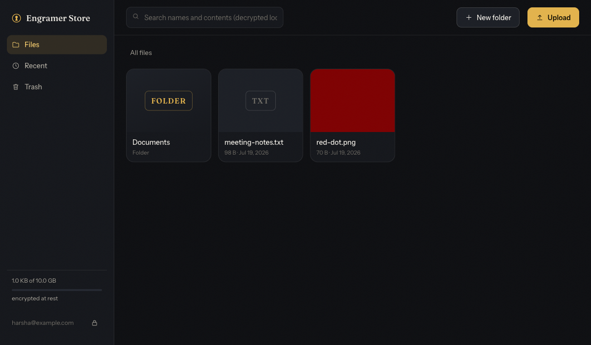

# Engram Store

**Self-hostable cloud storage that is end-to-end encrypted, and still smart.**

[](https://github.com/harsharahul/engramer-store/actions/workflows/ci.yml)
[](https://github.com/harsharahul/engramer-store/pkgs/container/engramer-store)
[](package.json)
[](LICENSE)

Files, file names, folder names, tags, and search text are encrypted on your device before upload; the server stores ciphertext it cannot read. Auto-categorization, full-text search, and previews all run on the client, so the intelligence works without giving anyone else your data.



## Why

Cloud storage should not require trusting the storage provider. Engram Store applies the end-to-end encryption model proven by [Ente](https://ente.io) to general-purpose file storage: the intelligence (search, previews, thumbnails) lives on the client, and the server is reduced to an authenticated ciphertext warehouse.

## Features

- **True end-to-end encryption.** XChaCha20-Poly1305 streaming encryption for file content, XSalsa20-Poly1305 for keys and metadata, Argon2id for password key derivation. All primitives from libsodium; no custom cryptography.
- **Drive-style file management.** Nested folders, drag-and-drop multi-file upload with per-file progress, rename, move, trash and restore. Dropping a folder preserves its whole structure, with thousands of small files moving through a bounded parallel pipeline that retries politely when throttled.
- **Version history on every file.** Each save keeps the previous content as a restorable version (last 10 by default), with per-version download and one-click restore that preserves the file's current name and tags. The write path is append-only, so an interrupted save can never corrupt a file. See [docs/storage.md](docs/storage.md).
- **Auto-organization.** Every upload is analyzed on your device and filed into category folders (Photos, Screenshots, Receipts, Code, and more) with auto-assigned tags: capture year, camera make, invoice, contract, resume. The Library sidebar gives live category views. All of it lives inside encrypted metadata; the server sees none of it. See [docs/intelligence.md](docs/intelligence.md).
- **Client-side search that finds what you half-remember.** One engine behind the top bar and the Cmd+K palette matches names (typo-tolerant), tags, folder names anywhere on a file's path, and full text extracted from documents, PDFs, and (with OCR on) images. Results show thumbnails, folder paths, and highlighted snippets, navigable entirely by keyboard, with filters like `tag:receipts`, `type:photo`, `in:Work`, `before:2026`. Queries never leave your device.
- **On-device OCR, opt-in.** Screenshots and scans become searchable by the text inside them, read locally by tesseract.js with every asset served from your own host. Recognized text is stored only inside encrypted metadata. See [docs/intelligence.md](docs/intelligence.md).
- **Search by meaning, opt-in.** Type "a dog on a beach" and matching photos and videos surface even when no filename or extracted text agrees, powered by an on-device CLIP model served from your own host. "Find similar" ranks the whole library by visual closeness. Embeddings live inside encrypted metadata like everything else. See [docs/intelligence.md](docs/intelligence.md).
- **Dates read out of your documents, opt-in.** Turn it on and the app reads what a document says about itself: when it expires, when a payment is due, the reference numbers that identify it. Driver's licence barcodes and passport machine-readable zones are read as structured fields with their own check digits rather than guessed from recognized characters, and every other barcode on a page is decoded too, so a booking reference becomes searchable. Nothing is acted on until you confirm it, and a date that could be read two ways asks which one rather than picking. A small set of rules then says the things worth interrupting for, including ones that need two documents at once: a passport stops being useful for travel about six months before the date printed on it, a residence permit can outlive the passport it is attached to, an insurance period can end with nothing newer stored. All of the reading happens on your device, reference numbers are kept as their last four characters in metadata, and the server sees none of it. See [docs/intelligence.md](docs/intelligence.md).
- **Trips proposed, never assumed, opt-in.** Boarding-pass barcodes and reservation files become the legs of a trip the app proposes; accepting writes a shared tag and nothing more. An offline airport table turns codes into cities and time zones, each leg exports to your calendar, and a month view shows tracked dates and trips together. Directions hand off to your maps app, because door-to-door timing would mean sending your location and route somewhere, and this feature refuses that. See [docs/intelligence.md](docs/intelligence.md).
- **Photos and Albums.** Every photo and video in one timeline with month sections and a favorites filter. Albums are stored as encrypted tags, so a photo can live in any number of them without copies.
- **Encrypted previews and thumbnails.** Images, PDFs, spreadsheets, Word documents and text all preview in the browser after local decryption. PDFs are drawn page by page on your device rather than handed to the browser's viewer, so they look the same in every browser and inside the desktop and iPhone apps, where no such viewer exists. Spreadsheets open as a table with a tab per sheet. Thumbnails are generated on the client and stored encrypted, with instant blurred placeholders painted before any bytes arrive.
- **Streaming playback that stays encrypted and verified.** Video and audio start immediately and seek to any timestamp without downloading the whole file. Media is stored in a random-access container of independently sealed chunks (XChaCha20-Poly1305), and a service worker answers the player's standard HTTP range requests by fetching and decrypting only the bytes playback touches, so memory stays flat regardless of file size and a 4K original streams as uploaded, with no transcoding and no reduced-quality proxy. Every chunk is authenticated before it reaches the player, a combination worth noting: encrypted-drive designs that gain seekability from counter-mode encryption can typically verify integrity only after a complete download, while here seeking and verification hold at the same time. Range requests are answered in bounded, chunk-aligned windows and upstream ciphertext connections are pooled and resumed across the player's many short reads, a shape tuned by measuring the real WebKit, Chromium, and Gecko media engines against a 1GB file so that request counts stay flat and total transfer stays near the file's own size.
- **Content verified end to end.** A digest of every file's bytes is taken on the device before encryption and checked after decryption, so the vault can prove that what comes back is what your file held, not merely what was uploaded. A vault of any size is spot-checked in seconds over a few kilobytes of requests, a full "Check every file" pass reads everything back, and each file's details show its integrity state.
- **Share links that keep the server blind.** Open links carry the decryption key in the URL fragment, which browsers never send over the wire. Optional link passwords wrap the key under Argon2id on your device, with the server holding only a verifier digest. Links support expiry, download limits (including one-time links), revocation, and a Shared view to manage them all. See [docs/sharing.md](docs/sharing.md).
- **Share with people, at a role.** A file can be shared to another account as a viewer or an editor through a claim-once invitation that carries no key material; the owner's device seals the file key to exactly the claiming account. Shared files arrive in a Shared with me view, concurrent saves resolve into a clean choice instead of an overwrite, and removing someone can rotate the key so the past stays theirs and the future does not. No endpoint resolves an email to an account. See [docs/sharing.md](docs/sharing.md).
- **Editing together, live.** Two people can edit the same Word document or spreadsheet at once and see each other's changes as they happen. Changes travel sealed under the file key over an ordered channel the server relays without reading; saving writes a normal encrypted version, and if the channel is unavailable the document stays editable one person at a time with no silent overwrites. See [docs/collaboration.md](docs/collaboration.md).
- **File requests.** A public link anyone can use to send files into your vault. Uploads are encrypted on the sender's device and sealed to your public key, then filed into the folder you chose automatically on your next sync. Not even the server can read what was sent.
- **Recovery keys.** A random recovery key, shown once at signup, can restore access after a lost password. Password changes re-wrap the master key without re-encrypting any data.
- **Two-factor authentication.** Standard TOTP with any authenticator app, QR enrollment, one-time recovery codes, replay-proof verification, and throttled login attempts. Key material is withheld until the second factor passes; the encryption itself stays derived from your password. See [docs/auth.md](docs/auth.md).
- **Unlock with your device.** Where a platform authenticator exists, the vault key can rest on-device as ciphertext wrapped under a key only Touch ID, Face ID, or a passkey releases, so one touch reopens the vault and signing out revokes the enrollment. The Mac app keeps the secret in the Keychain behind the biometric prompt; the iPhone app asks Face ID at open.
- **In-app editing and notes.** Edit text, Markdown, and code in the browser, or create notes from the command palette. Content decrypts into the editor and re-encrypts on save; edits are instantly searchable. Why editing encrypted documents constrains the choice of editor, and what that choice cost, is in [docs/editing.md](docs/editing.md).
- **Word and Excel editing, fully client-side.** Open a .docx or .xlsx and edit it in a real office engine that runs entirely in your browser: formulas, charts, images, tables and tracked changes survive a round trip, because the document is edited in its own format rather than converted through a lossy intermediate. Nothing is converted on a server, which is the reason the usual self-hosted office integrations cannot work on encrypted storage at all. The editor runs in a frame with an opaque origin, so the vendored third-party code that does the editing cannot reach the page holding your keys, its storage, or your session; it receives bytes and returns bytes. Saving re-encrypts under the file's existing key and keeps the previous version. See [docs/office-editing.md](docs/office-editing.md).
- **Watch folders on the desktop.** Point the desktop app at a folder and anything that appears in it is encrypted and uploaded on its own. One-way by design: nothing local is ever changed or deleted, and a file already in the vault is never uploaded twice. Each watched folder is filed the way you choose: sorted by kind like any other upload, tagged with the folder's name so you can still find the group, or kept as a folder of its own in the vault, subfolders and all.
- **A Finder drive on the Mac.** The Mac app puts the vault under Locations in Finder's sidebar, beside iCloud Drive. Files download and decrypt as they are opened, new and edited files encrypt and upload in place, deletions go to the vault's trash, and a conflicting save becomes a "(conflicted copy)" rather than lost work. Right-clicking a drive file copies a working share link. The app ships as a notarized DMG that asks for your server on first launch, so one download serves any deployment; get it from the [releases page](https://github.com/harsharahul/engramer-store/releases). See [docs/native-apps.md](docs/native-apps.md).
- **The vault in the iPhone's Files app.** The iPhone app makes the vault a drive in Files and in every app's file picker: browse it, open from it, save into it, edit in place. The share sheet saves into the vault from any app, and opt-in photo backup uploads originals without ever recompressing them, with Wi-Fi-only, video, screenshot, and how-far-back choices. Face ID unlocks at open, and a server picker on the sign-in screen means one app serves any deployment, self-hosted included. See [docs/native-apps.md](docs/native-apps.md).
- **Installable app.** The web client is a PWA: add it to your iPhone home screen or your Mac Dock and it runs standalone with its own icon. Paste a screenshot anywhere in the app to store it encrypted. What runs where is in [docs/native-apps.md](docs/native-apps.md).
- **Local S3 bridge.** A self-hostable, zero-knowledge S3 endpoint (`apps/bridge`) lets any S3 tool (rclone, s3fs, the AWS SDK) browse and download your encrypted vault, with folders as buckets, while the server still holds only ciphertext. See [docs/s3-gateway.md](docs/s3-gateway.md).
- **Storage tiering that works on ciphertext.** Originals and derived blobs can live on different object stores with opposite economics: request-heavy small blobs on a fast store, byte-heavy content on cheap or rate-limited storage. When the split is on, every file leaves hot copies of its opening and closing bytes on the fast store, so playback starts and the container indexes media players read first never wait on the slow one; the copies write themselves for new uploads and self-heal for old files, with no migration step. The server also keeps a bounded on-disk cache of aligned ciphertext windows, warmed by uploads themselves, so a file plays back smoothly the moment it finishes uploading and repeat viewing costs the backing store nothing. Per-backend request budgets pace a throttled store below its limit instead of tripping it. All of this operates on opaque ciphertext; the server never decrypts anything to place it.
- **Bring your own cloud storage.** The vault can keep its ciphertext on storage you already pay for. Providers with an S3 API (FileLu S5, MinIO, Cloudflare R2 and the rest) connect directly; most others, including Drime, pCloud, Dropbox and Google Drive, connect through a bundled rclone gateway profile configured with one token in an `.env` file. Because every byte is encrypted before upload, the provider only ever holds unreadable blobs under meaningless names. Thumbnails, search indexes, and the opening and closing bytes of every video stay on the server's own disk, and small documents are cached locally after their first read, so browsing, search, and playback feel local while the provider supplies the durable bytes; if the provider is down or throttled, everything already local keeps working. See [docs/backends.md](docs/backends.md).
- **Quotas and delta sync.** Per-user storage quotas enforced during streaming upload, and a sequence-number sync protocol so clients converge in one round trip.
- **Registration policy and an admin panel.** Registration can be `open`, `invite`, or `closed`; admins named by environment variable get an inline panel to list accounts, mint and revoke invites, override quotas, and disable or delete accounts. There is deliberately no password reset, because the server never holds key material; the recovery key is the only way back in. Metadata lives in SQLite by default or PostgreSQL for replicated deployments. See [docs/auth.md](docs/auth.md).

## What the server can and cannot see

The server stores: ciphertext blobs, wrapped keys, KDF parameters, a one-way digest of the login key, blob sizes, timestamps, and the shape of your folder tree.

The server can never see: file contents, file names, folder names, thumbnails, extracted search text, your password, or any decryption key. This holds even if the server is fully compromised. The full design is in [docs/architecture.md](docs/architecture.md).

## Quickstart

### Docker

```bash
docker run -d --name engramer -p 3080:3080 -v engramer-data:/data \
  ghcr.io/harsharahul/engramer-store:latest
```

Or with Compose: `docker compose up -d` (see [compose.yml](compose.yml)). All state lives in the `/data` volume.

### On cloud storage you already pay for

Point the vault at Drime, pCloud, or any other provider rclone reaches:

```bash
cp .env.example .env       # paste your provider token; the file explains each line
docker compose -f compose.rclone.yml --profile drime up -d
```

Create a token with your provider (Drime: Settings, then Developer), fill in `.env`, start the profile, and open port 3080. Providers with a real S3 API, such as FileLu S5, skip the gateway entirely: set `ENGRAMER_S3_*` and use the plain compose file. What appears in your provider account is a single folder of encrypted blobs; recipes, provider notes, and the reasoning are in [docs/backends.md](docs/backends.md).

### From source

Requirements: Node.js 22+ and pnpm.

```bash
pnpm install
pnpm --filter @engramer/web build   # build the web client
pnpm --filter @engramer/server start
```

Open http://127.0.0.1:3080, create a vault, and store your recovery key somewhere safe. All state lives under `apps/server/data/`.

To use it as an app: on iPhone, open the site in Safari, tap Share, then "Add to Home Screen"; on a Mac, use Safari's File menu, "Add to Dock" (or Chrome's Install button).

## Using it

- **Create** a note, a Word document, a spreadsheet or a folder from the **New** menu in the top bar, or from the command palette with `Cmd+K`. A new document is created encrypted in your vault and opens straight into the editor.
- **Edit** a .docx or .xlsx by opening it and choosing **Edit**. Everything runs on your device; saving keeps the previous version, so an edit is undoable like any other change.
- **Preview** anything by double-clicking it. PDFs, spreadsheets, Word documents, images, text, video and audio all render without leaving your device.
- **Find** things from the search box or `Cmd+K`: names, tags, folder names, and text inside documents, PDFs and (with OCR on) images. Filters like `tag:receipts`, `type:photo`, `in:Work` and `before:2026` narrow it down.
- **Watch a folder** in the desktop app, under your account menu, then Watch folders. Choose per folder whether arrivals are sorted by kind and tagged with the folder's name, or kept together in a folder of the same name.
- **Share** a file with a link that carries its key in the URL fragment, which browsers never send to a server. Add a password, an expiry, or a download limit; revoke it at any time from **Shared**.

Configuration via environment variables:

| Variable | Default | Purpose |
|---|---|---|
| `ENGRAMER_PORT` | `3080` | Listen port |
| `ENGRAMER_HOST` | `127.0.0.1` | Bind address |
| `ENGRAMER_DATA_DIR` | `data` | SQLite database and blob storage location |
| `ENGRAMER_QUOTA_BYTES` | `10737418240` | Per-user storage quota (10 GB) |
| `ENGRAMER_MAX_BLOB_BYTES` | `21474836480` | Hard cap for a single upload |
| `ENGRAMER_WEB_DIST` | auto-detected | Path to a built web client to serve |
| `ENGRAMER_S3_BUCKET` | unset | Store blobs in an S3-compatible bucket instead of local disk |
| `ENGRAMER_DERIVED_BACKEND` | unset | `fs` keeps thumbnails and search indexes on local disk while content lives on a remote store |
| `ENGRAMER_CONTENT_CACHE_MAX_BYTES` | unset | Cache content blobs at or under this size on local disk, so repeat document opens are instant |
| `ENGRAMER_PUBLIC_ORIGINS` | unset | Origins browsers reach this server on, when a proxy rewrites the Host header (Word and Excel editing needs this) |
| `ENGRAMER_DATABASE_URL` | unset | PostgreSQL connection string; replaces SQLite for replicated deployments |
| `ENGRAMER_JWT_SECRET` | generated | Session-signing secret; set it explicitly when running more than one instance |
| `ENGRAMER_REGISTRATION` | `open` | `open`, `invite`, or `closed` |
| `ENGRAMER_ADMIN_EMAILS` | unset | Comma-separated admin accounts; enables the inline admin panel |
| `ENGRAMER_MAX_VERSIONS` | `10` | Versions kept per file; `0` disables history |
| `ENGRAMER_COLLAB_RELAY` | `on` | `off` disables live co-editing; documents stay editable one person at a time |
| `ENGRAMER_TRUSTED_PROXIES` | unset | Hop count or address allowlist for forwarded headers behind a proxy |
| `ENGRAMER_CORS_ORIGINS` | unset | Extra origins allowed to call the API |
| `ENGRAMER_MAC_DMG_URL` | unset | Where this deployment hosts the Mac app DMG; adds a "Get the Mac app" row to Profile |

The full list, including the storage tiering, cache, and request-budget knobs, is in [docs/storage.md](docs/storage.md) and [docs/backends.md](docs/backends.md).

Run it behind TLS in production; the login key must only ever travel over HTTPS. Storage architecture, the S3-compatible backend, and backup recipes are covered in [docs/storage.md](docs/storage.md). Consumer cloud storage (Drime, pCloud, FileLu, and anything rclone reaches) as the backing store is covered in [docs/backends.md](docs/backends.md), with ready compose recipes in `compose.rclone.yml`. A design for exposing an S3 API lives in [docs/s3-gateway.md](docs/s3-gateway.md), and the reasoning behind the document editor is in [docs/editing.md](docs/editing.md).

## Development

```bash
pnpm --filter @engramer/server dev   # API server with reload, port 3080
pnpm --filter @engramer/web dev      # Vite dev server, port 5173, proxies /api
pnpm test                            # crypto, web, and server suites
pnpm build                           # typecheck and build everything
docker build -t engramer-store .     # container image
```

The repository is a pnpm workspace:

```
packages/crypto/   E2EE core: key hierarchy, streaming encryption, sealed boxes
apps/server/       Zero-knowledge API: Fastify, SQLite or PostgreSQL metadata, pluggable blob stores
apps/web/          Web client: React, all crypto in the browser
apps/desktop/      Tauri 2 shell for the Mac and iPhone apps, with the Files/Finder extensions
apps/bridge/       Local zero-knowledge S3 endpoint over the vault
crates/            Rust crypto core, byte-compatible with packages/crypto, for the Apple targets
```

The integration tests drive the real API with the real crypto package, including a check that blobs on disk contain no plaintext, and an end-to-end suite that runs against a real `rclone serve s3` gateway asserting byte equality on every transfer shape. CI runs the suites on Node 22 and 24, audits production dependencies, and smoke-tests the container image on every pull request; pushes to main and published releases build and push a multi-architecture image to `ghcr.io`.

## Security

See [SECURITY.md](SECURITY.md) for the threat model and how to report vulnerabilities.

## License

[AGPL-3.0-only](LICENSE).
